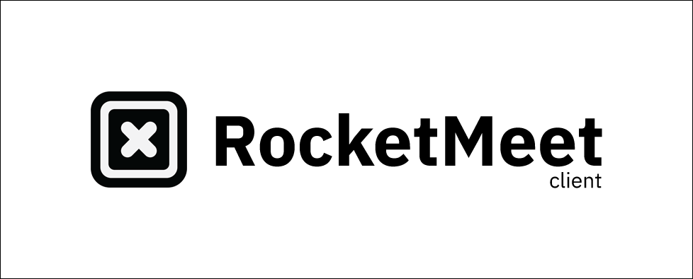

[](https://github.com/RocketMeet/RocketMeet-client/blob/main/LICENSE)
[](https://gitter.im/RocketMeet/community)


## Table of contents
---
* [Description](#description)
* [features](#features)
* [Community](#community)
* [API Documentation](#api-documentation)
* [Getting Started](#getting-started)
* [Prerequisites](#prerequisites)
* [Installation](#installation)
* [Setup](#setup)
    * [Development](#development)
    * [Testing](#test)
    * [Production](#production)
* [Deployment](#deployment)
    * [Deploy with vercel](#vercel)
* [Contributing](#contributing)
* [License](#license)


<a name="description"></a>
## Description

RocketMeet is an online meet scheduling app. Find the best time for team meetings and one-on-ones with RocketMeet. [Try now](https://rocketmeet.me)!

<a name="community"></a>
## Community

Come say hello at our [chatroom](https://gitter.im/RocketMeet/community) for discussions, voicing new ideas or getting help!

<a name="api-documentation"></a>
## API Documentation

You can find the API documentation for the server [here](https://documenter.getpostman.com/view/10544125/TW6wJodh) and the mailer [here](https://documenter.getpostman.com/view/9605987/TW6wHo7V).

<a name="getting-started"></a>
## Getting Started

<a name="prerequisites"></a>
### Prerequisites

- `NodeJS v14`

<a name="installation"></a>
### Installation

```bash
$ git clone https://github.com/RocketMeet/RocketMeet-client.git

$ cd RocketMeet-client

$ npm i
```
<a name="setup"></a>
### Setup

- Make a copy of the `.env.development.example` and `.env.production.example` files to `.env.development` and `.env.production` files respectively. 
- Create a firebase account , setup `firebase-auth` for google sign-in , whitelist the client domain in the `Authorised domains` section in firebase console. Set firebase config variables in `.env` files.
- Set the encryption variables and domain URLs in the `.env` files

<a name="development"></a>
### Development 

```bash
$ npm run dev
```
<a name="linting"></a>
Linting
```bash
$ npx eslint . --ext .tsx,.ts
```
> Note: Or simply setup automatic linting in `vscode`

<a name="test"></a>
Testing

```bash
$ npm run test
```

<a name="production"></a>
### Production

```bash
$ npm run build

$ npm start
```

<a name="deployment"></a>
## Deployment

Make a copy of the `.env.production.example` file to `.env.production` and set the environment variables.

<a name="vercel"></a>
## Deploy with vercel

> Note: You need to have the [RocketMeet-server](https://github.com/RocketMeet/RocketMeet-server) and [RocketMeet-mailer](https://github.com/RocketMeet/RocketMeet-mailer) setup before using this one-click deployment. Make sure to create a firebase account and setup `firebase-auth` for google signin. 

Set the environment variables in `.env.production.example` to vercel in the next step.

[](https://vercel.com/new/git/external?repository-url=https%3A%2F%2Fgithub.com%2FRocketMeet%2FRocketMeet-client&project-name=rocketmeet-client-demo&repository-name=RocketMeet-client&demo-title=RocketMeet%20Demo)

<a name="contributing"></a>
## Contributing

Check out our [contributing guide](https://github.com/RocketMeet/RocketMeet-client/blob/main/CONTRIBUTING.md)!

<a name="license"></a>
## License

RocketMeet-client is distributed under the [MIT License](https://github.com/RocketMeet/RocketMeet-client/blob/main/LICENSE).

