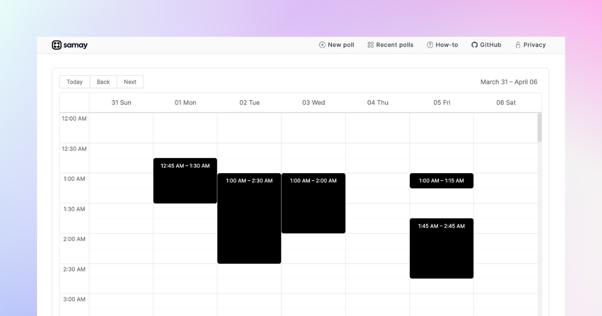

<div align="center">
  <a href="https://www.kukkee.com/">
    
  </a>
  <p>
    <b>
      Kukkee — meeting poll tool.
    </b>
  </p>
  <p>

[](https://github.com/Kukkee/Kukkee/blob/main/LICENSE)
[](https://github.com/Kukkee/Kukkee/graphs/contributors)
[](https://kukkee.com/)

  </p>
  <br />
</div>

[](https://kukkee.com)

# Self-hosting

I'm happy that you've decided to get your own Kukkee up and running!

## Docker

Coming soon!

## Manual

The manual guide is divided into two sections: database and deployment.

### Database

Kukkee uses MongoDB, hence you would need a MongoDB server hosted somewhere.

#### MongoDB Atlas

In case you don't have a hosted MongoDB server, you can [get started with MongoDB Atlas](https://www.mongodb.com/basics/mongodb-atlas-tutorial) for free.
If you're planning to use Vercel to deploy your own Kukkee, you must add all IP addresses (0.0.0.0/0) to the IP access list of your Atlas cluster since it is not possible to determine the IP addresses of Vercel deployments.

### Deployment

Kukkee is built with Next.js. Hence, you would need to deploy Kukkee to a platform that supports Next.js.

For example, Vercel, AWS EC2 or a DigitalOcean Droplet.

#### Vercel

In case you don't have a platform already, you can get started with Vercel for free.

1. Fork this repo to your own GitHub account and then clone it.
2. Go to https://vercel.com/dashboard
3. Create a new project
4. Import your forked git repository
5. Set the environment variables (according to the instructions in .env.example)
6. Deploy

# Contributing

I'm thrilled that you'd like to contribute to Kukkee!

## Issues and PRs

If you have suggestions for how this project could be improved, or want to report a bug, open an issue! I'd love all and any contributions. If you have questions, too, I'd love to hear them. [Start a new discussion](https://github.com/Kukkee/Kukkee/discussions/new) on GitHub!

I'd also love PRs. If you're thinking of a large PR, please open up an issue first to discuss your proposed changes with a project maintainer!

## Development

First, make sure you have [Node.js](https://nodejs.org/en/) and [MongoDB](https://www.mongodb.com/docs/manual/installation/#mongodb-installation-tutorials) installed. Then, to develop locally:

1. Fork this repo to your own GitHub account and then clone it.

   ```sh
   git clone https://github.com/<your-username>/Kukkee.git
   ```

2. Go to the project folder

   ```sh
   cd Kukkee
   ```

3. Create a new branch:

   ```sh
   git checkout -b MY_BRANCH_NAME
   ```

4. Install the dependencies with:

   ```sh
   npm i
   ```

5. Copy `.env.example` to `.env`

   ```sh
   cp .env.example .env
   ```

6. Set the env variables according to the instructions in the .env file

7. Start developing and watch for code changes:

   ```sh
   npm run dev
   ```

## Building

You can build the project with:

```bash
npm run build
```

Please be sure that you can make a full production build before pushing code.

## Submitting a pull request

1. Fork and clone the repository.
2. Configure and install the dependencies.
3. Make sure the tests and linters pass on your machine.
4. Create a new branch.
5. Make your change, add tests, and make sure the tests still pass.
6. Push to your fork and open a pull request against the `main` branch.
7. Pat your self on the back and wait for your pull request to be reviewed and merged.

Here are a few things you can do that will increase the likelihood of your PR being accepted:

- Keep your changes as focused as possible. If there are multiple changes you would like to make that are not dependent upon each other, consider submitting them as separate pull requests.
- Write a [good commit message](http://tbaggery.com/2008/04/19/a-note-about-git-commit-messages.html).

"WIP" PRs are also welcome to get feedback early on, or if there is something blocking you.

# Acknowledgements

Special thanks to these amazing projects which help power Kukkee:

- [react-available-times](https://github.com/trotzig/react-available-times)
- [Next.js](https://nextjs.org)
- [NextAuth.js](https://next-auth.js.org)
- [Vercel](https://vercel.com)
- [Day.js](https://day.js.org)
- [Bootstrap](https://getbootstrap.com)
- [MongoDB Atlas](https://www.mongodb.com)
- [Mongoose](https://mongoosejs.com)

# License

Kukkee is distributed under the [MIT License](https://github.com/AnandBaburajan/Kukkee/blob/main/LICENSE).
